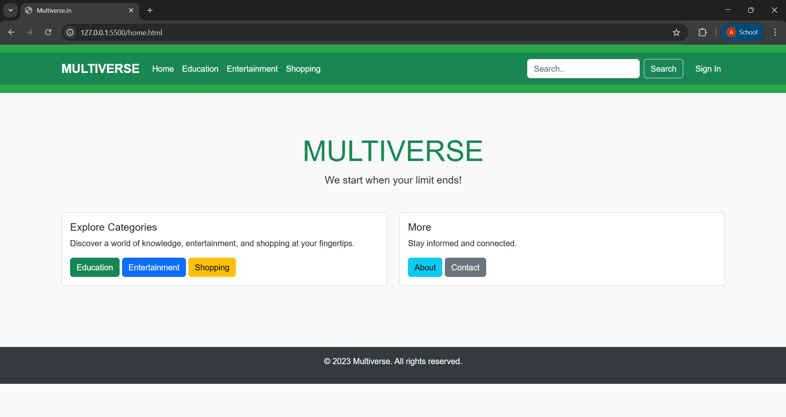
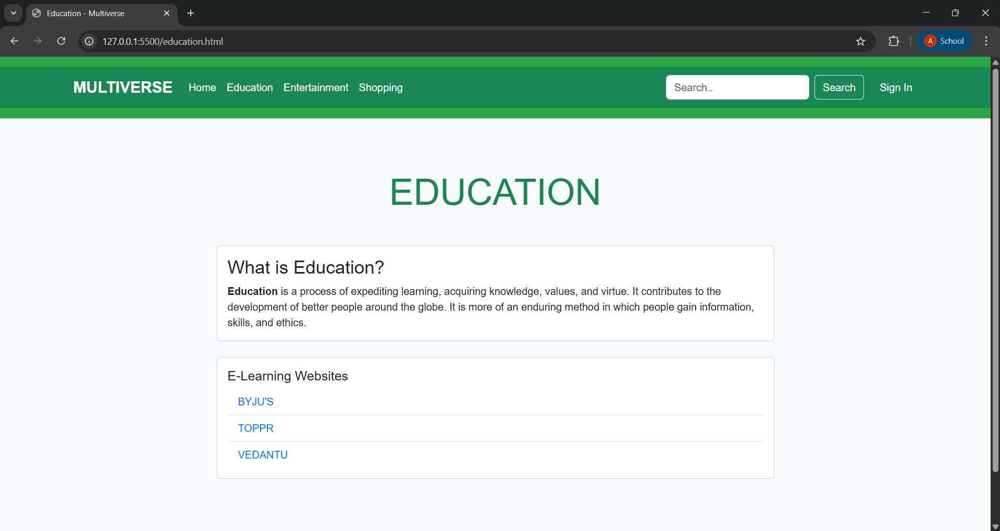
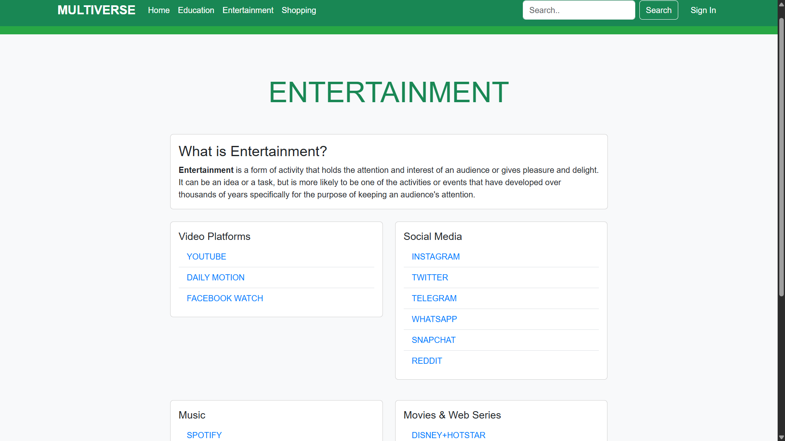
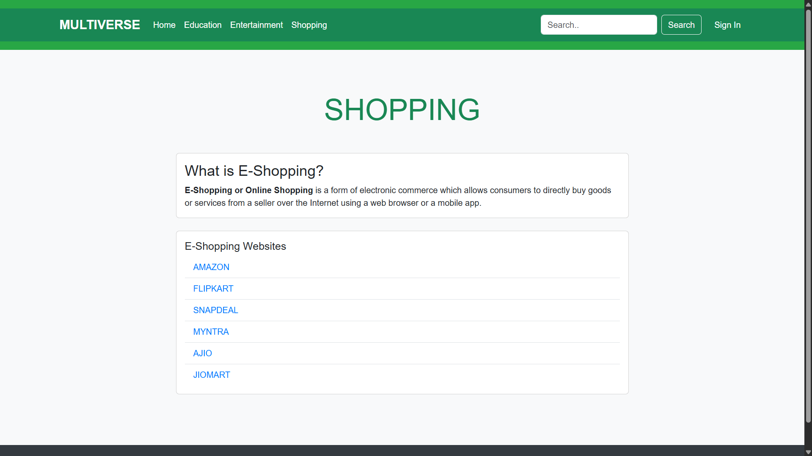

# 🌌 Multiverse Website

A comprehensive, multi-category informational platform developed during my **Diploma in Information Technology at Government Polytechnic Mumbai**. This project showcases clean web architecture and practical content organization through semantic HTML and modern CSS fundamentals.


---

## 📸 Interface Preview

<div align="center">
  <table border="0">
    <tr>
      <td align="center"><b>Home</b></td>
      <td align="center"><b>Education</b></td>
    </tr>
    <tr>
      <td></td>
      <td></td>
    </tr>
    <tr>
      <td align="center"><b>Entertainment</b></td>
      <td align="center"><b>Shopping</b></td>
    </tr>
    <tr>
      <td></td>
      <td></td>
    </tr>
  </table>
  <p><i>"We start when your limit ends!" — A modular design for content exploration.</i></p>
</div>

---

## ✨ Key Features

The platform is organized into distinct functional modules for a seamless user journey:

* **🧭 Unified Navigation:** A centralized header providing instant access to all categories, featuring integrated search and authentication placeholders.
* **🎓 Education Hub:** Curated links to leading e-learning platforms including BYJU'S, TOPPR, and VEDANTU.
* **🎬 Entertainment Portal:** A tiered directory covering Video Platforms (YouTube), Social Media (Instagram/Twitter), Music (Spotify), and Streaming Services.
* **🛍️ E-Shopping Directory:** A comprehensive collection of major retail platforms like Amazon, Flipkart, and Myntra.
* **📱 Responsive Layout:** Built using modern CSS and Bootstrap components to ensure readability across devices.

---

## 🎨 Design Philosophy

* **Bento-Inspired Cards:** Information is grouped into clean, scannable cards to improve user focus and content hierarchy.
* **Semantic Structure:** Heavy emphasis on proper HTML5 tags for accessibility and SEO-friendly architecture.
* **Visual Consistency:** A professional green-themed navigation (`bg-success`) paired with a neutral slate background for high-contrast readability.

---

## 🛠️ Tech Stack

| Component | Technology |
| :--- | :--- |
| **Markup** | HTML5 |
| **Styling** | CSS3 & Bootstrap 5.3 |
| **Deployment** | GitHub Pages |

---

## 🚀 Getting Started

1.  **Clone the repository:**
    ```bash
    git clone [https://github.com/abhijithshetty12/Multiverse-Website.git](https://github.com/abhijithshetty12/Multiverse-Website.git)
    ```
2.  **Launch the site:**
    Open `home.html` in any modern web browser.

---

## 👤 Author

**Abhijith Shetty**
* GitHub: [@abhijithshetty12](https://github.com/abhijithshetty12)
* Institution: Government Polytechnic Mumbai

---

<div align="center">
  <h3>🌟 Show your support</h3>
  <p>If you find this project helpful, please give it a ⭐ on GitHub!</p>
  
  <a href="https://github.com/abhijithshetty12/Multiverse-Website">
    
  </a>
</div>
